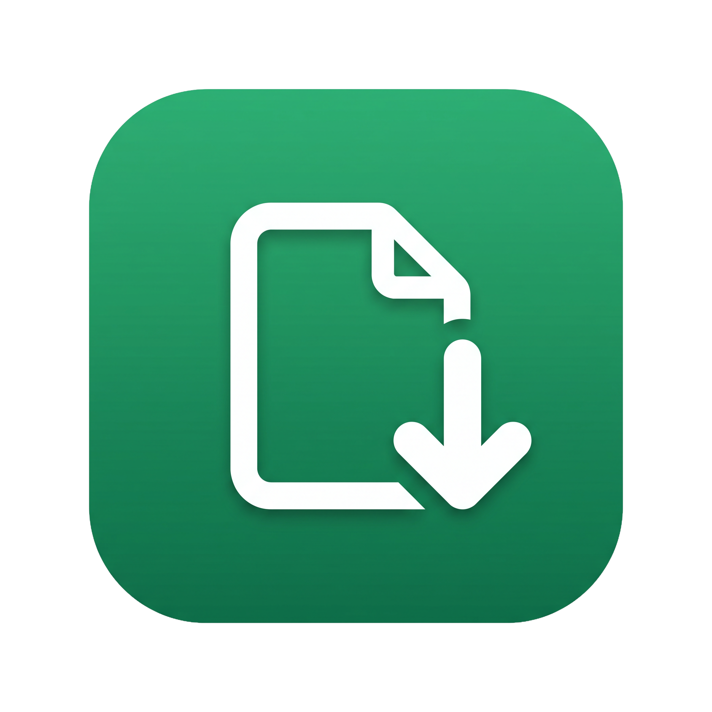

<div align="center">



# DragIn1

**Drag attachments out of New Outlook again.**

Free, open source, runs entirely on your PC.
No account, no network, no telemetry.

[Download](../../releases/latest) · [How it works](docs/how-it-works.md) · [Build from source](#build-it-yourself)

</div>

---

## The problem

Drag an attachment out of New Outlook and drop it on a folder, an upload box, or
another app. Nothing happens. No error, no file, just a cursor that refuses.

This is not your machine and it is not a bug you can fix in settings. New
Outlook, Teams, Gmail, SharePoint and OneDrive are all Chromium under the hood,
and Chromium hands out dragged files differently from a normal Windows app.

It **offers** the file, then waits for the receiving app to ask for it a
specific way. Almost no Windows application asks that way. So Chromium never
produces the bytes, and the drop quietly does nothing.

## The fix

DragIn1 is a small window that knows how to ask.

1. Drop an attachment on the DragIn1 window.
2. DragIn1 completes the handshake Chromium is waiting for and saves the real file.
3. Drag it from DragIn1 into anything at all.

By the time it leaves DragIn1 it is an ordinary file on disk, dragged by an
ordinary Windows app. Explorer, upload boxes, Slack, your ERP, Photoshop,
anything. Nothing on the receiving end has to cooperate or even know DragIn1
exists.

There is also a **Ctrl+C** shortcut that puts captured files on the clipboard,
for upload dialogs that take a paste.

## Works with

| Drag from | Drop onto |
|---|---|
| New Outlook (`olk.exe`) | File Explorer |
| Outlook on the web | Browser upload boxes |
| Microsoft Teams | Any Windows desktop app |
| Gmail | CRMs, ERPs, document systems |
| SharePoint, OneDrive | Chat apps, ticketing systems |

Windows 10 and 11. Needs .NET Framework 4.x, which is already on every Windows
10 and 11 machine.

## Install

Download **`DragIn1-Setup.exe`** from [Releases](../../releases/latest) and run it.
One file. No admin rights. Installs just for you.

<details>
<summary><b>Windows will warn you. Here is why, and what to do.</b></summary>

<br>

You will see **"Windows protected your PC."** Click **More info → Run anyway**.

This is SmartScreen, and it appears because DragIn1 is not code signed. A
certificate that removes the warning costs a few hundred dollars a year, which
is not something a free tool can carry. The warning is about the absence of a
paid certificate, not about anything detected in the file.

If you would rather not take that on faith, you do not have to:

- Every line of source is in this repo. It is two C# files.
- Each release publishes a **SHA256** so you can verify the download.
- You can [build it yourself](#build-it-yourself) in about two seconds, using a
  compiler already on your machine. No SDK, no downloads.

The warning will keep coming back on each new release, because SmartScreen ties
its reputation to a specific file hash and every release is a new file.

</details>

## Using it

DragIn1 opens as a small always-on-top window in the bottom right.

| Action | What happens |
|---|---|
| Drop a file on it | Captured and saved, ready to drag out |
| Drag an item out | A normal Windows file drag |
| Double-click | Opens the file |
| **Ctrl+C** | Puts files on the clipboard to paste into upload dialogs |
| **Ctrl+A** | Select all |
| **Delete** | Removes from the list, leaves the file on disk |
| Right-click | Open, Show in folder, Always on top, Start with Windows |

Captured files go to `%LOCALAPPDATA%\DragIn1\` and are cleaned up after 7 days.

## Privacy

DragIn1 makes no network connections of any kind. No accounts, no licence
checks, no update pings, no analytics. It reads the file you dropped, writes it
to your own disk, and hands it to whatever you drag it to. That is the entire
data flow, and you can confirm it by reading `DragIn1.cs`.

## Build it yourself

You do not need Visual Studio, the .NET SDK, or an internet connection. The C#
compiler has shipped inside Windows since .NET Framework 4.

```
git clone https://github.com/<your-user>/DragIn1.git
cd DragIn1
Build-Installer.cmd
```

That produces `DragIn1.exe` and `DragIn1-Setup.exe`. Takes about two seconds.

`Build-DragIn1.cmd` builds just the app if you want to skip the installer.

The icon is generated from `Logo_raw.png` by `make-icon.py` (needs Pillow). You
only need to run it if you change the artwork; `DragIn1.ico` is committed.

## Uninstall

**Settings → Apps → Installed apps → DragIn1 → Uninstall.**

It asks whether to keep the files it captured. Nothing is left behind either
way: no services, no drivers, no shell extensions, no scheduled tasks.

## How it actually works

The short version: Chromium sources advertise dragged files through
`IDataObjectAsyncCapability` with async mode enabled, and refuse to render the
bytes to any drop target that just calls `GetData(CF_HDROP)` synchronously. You
get `DV_E_FORMATETC` and nothing else. The file only materialises for a target
that calls `GetAsyncMode`, then `StartOperation`, extracts off the UI thread,
and calls `EndOperation`.

Hardly anything implements that sequence, which is why this looks broken
everywhere at once.

[**Full write-up with the evidence →**](docs/how-it-works.md)

## Why two drags instead of one?

Making it a single gesture means injecting code into Outlook and Chrome to
intercept the drag at the source. That works, and it is what commercial tools in
this space do, but it means running unsigned code inside Microsoft processes,
tripping antivirus, and re-fixing it every time Outlook updates.

DragIn1 stays outside every other process. It costs one extra gesture and it
cannot break your email client. That trade felt like the right one for something
people install and forget about.

## Contributing

Issues and pull requests welcome. Useful things to report:

- A source app whose drags are not captured (say which app and which build)
- A destination that rejects a drag out of DragIn1
- Multi-file drags, very large attachments, or unusual filenames

## Code signing

How releases are built, what a signature attests to, how to verify a download,
and exactly what DragIn1 changes on your system:
[**Code signing policy**](CODE_SIGNING_POLICY.md).

## License

MIT. See [LICENSE](LICENSE).

Made by [WildTech Development](https://wildtechdev.com).
